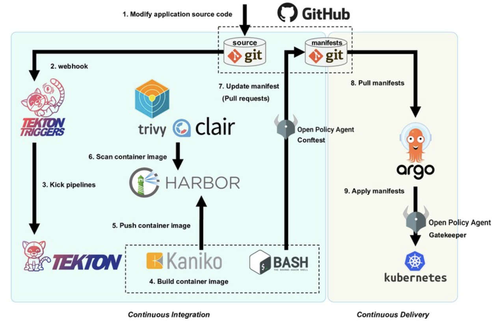

# Presentation

https://speakerdeck.com/masayaaoyama/cndt2020-k8s-amsy810



# 事前準備

## リポジトリのフォーク

このリポジトリを特定のOrganizationにフォークしてください。
パブリックリポジトリの状態でのみ動作確認済みです。

* 証明書発行時に利用するメールアドレス（spec.acme.email）を変更してください。
  * infra/cert-manager.yaml
* oauth2-proxy 実行時のオプションを変更し、認証を許可する GitHub ユーザを指定してください。（--github-user=YOUR_GITHUB_USER）
  * infra/oauth2proxy.yaml
* ArgoCD が GitOps の対象とするリポジトリ（spec.source.repoURL）をフォーク先のGitHubにしてください（YOUR_GITHUB_ORG_NAME）。
  * infra/argocd.yaml
* Ingressがリクエストを受け付けるFQDNを自分のドメイン（YOUR_DOMAIN）にすべて変更してください（spec.rules[].host および spec.tls[].hosts[]）。
  * infra/ingress.yaml
* spec.params{name: DOMAIN} の value の値を自分のドメイン（YOUR_DOMAIN）に2箇所とも変更してください
  * infra/tekton-triger.yaml
* OAuth2 Proxyのドメイン設定（--whitelist-domain, --redirect-url, --cookie-domain）を自分のドメイン（YOUR_DOMAIN）に変更してください
  * infra/oauth2proxy.yaml
* microservice が利用するイメージの参照先を自分のドメイン（YOUR_DOMAIN）に向けてください
  * manifests/microservice-a/app.yaml
  * manifests/microservice-b/app.yaml
  * manifests/microservice-a/serviceaccount.yaml
  * manifests/microservice-b/serviceaccount.yaml


## GCP環境のセットアップ

```
export GCP_PROJECT=$(gcloud config get-value core/project)
export GCP_REGION=${gcloud config get-value compute/region:-asia-northeast1}
```

## 利用するIPアドレスの取得

```
LOADBALANCER_IP_NAME=k8s-native-cicd
gcloud compute addresses create ${LOADBALANCER_IP_NAME} --project=${GCP_PROJECT} --region=${GCP_REGION}
export LOADBALANCER_IP_ADDRESS=$(gcloud compute addresses list --filter="name=${LOADBALANCER_IP_NAME}" --format="value(address)")
```

## ドメインの取得とIPアドレスの紐付け

ドメインを取得し、取得したIPアドレス（LOADBALANCER_IP_ADDRESS）と紐付けます。
Free Domainの freenom を利用したり、Google Domains などを利用すると良いでしょう。
ex) Free domain service: https://my.freenom.com/

```
export YOUR_DOMAIN=example.com
YOUR_DOMAIN = $LOADBALANCER_IP_ADDRESS
tekton.YOUR_DOMAIN = $LOADBALANCER_IP_ADDRESS
argocd.YOUR_DOMAIN = $LOADBALANCER_IP_ADDRESS
harbor.YOUR_DOMAIN = $LOADBALANCER_IP_ADDRESS
notary.YOUR_DOMAIN = $LOADBALANCER_IP_ADDRESS
oauth2.YOUR_DOMAIN = $LOADBALANCER_IP_ADDRESS
```

## Tekton pipeline で利用する GitHub の Personal Access Token の取得

* https://github.com/settings/tokens/new

```
export YOUR_GITHUB_ORG_NAME=kubernetes-native-testbed
export YOUR_GITHUB_USER=kubernetes-native-testbed-user
export YOUR_GITHUB_TOKEN=xxxxxxxxxxxxxxxxxxxxxxxxxxxxxxxxxxxx

cat << _EOF_ | kubectl apply -f -
apiVersion: v1
kind: Secret
metadata:
  name: github-credentials
  namespace: tekton-pipelines
  annotations:
    tekton.dev/git-0: https://github.com
type: kubernetes.io/basic-auth
stringData:
  username: ${YOUR_GITHUB_USER}
  password: ${YOUR_GITHUB_TOKEN}
  organization: ${YOUR_GITHUB_ORG_NAME}
_EOF_
```

## OAuth2 Proxyで利用する GitHub OAuth2 App の登録

* OAUTH2_PROXY_CLIENT_ID
* OAUTH2_PROXY_CLIENT_SECRET
    * https://github.com/settings/applications/new
        * Application name: kubernetes native cicd test
        * Homepage URL: https://YOUR_DOMAIN/
        * Callback URL: https://oauth2.YOUR_DOMAIN/oauth2/callback
* OAUTH2_PROXY_COOKIE_SECRET
    * docker run -ti --rm python:3-alpine python -c 'import secrets,base64; print(base64.b64encode(base64.b64encode(secrets.token_bytes(16))));'

```
export YOUR_OAUTH2_PROXY_CLIENT_ID=xxxxxxxxxxxxxxxxxxxxxxxxxxxxxxxxxxxx
export YOUR_OAUTH2_PROXY_CLIENT_SECRET=xxxxxxxxxxxxxxxxxxxxxxxxxxxxxxxxxxxx
export YOUR_OAUTH2_PROXY_COOKIE_SECRET=xxxxxxxxxxxxxxxxxxxxxxxxxxxxxxxxxxxx

cat << _EOF_ | kubectl apply -f -
apiVersion: v1
kind: Secret
metadata:
  labels:
    k8s-app: oauth2-proxy
  name: oauth2-proxy
  namespace: kube-system
type: Opaque
stringData:
  OAUTH2_PROXY_CLIENT_ID: ${YOUR_OAUTH2_PROXY_CLIENT_ID}
  OAUTH2_PROXY_CLIENT_SECRET: ${YOUR_OAUTH2_PROXY_CLIENT_SECRET}
  OAUTH2_PROXY_COOKIE_SECRET: ${YOUR_OAUTH2_PROXY_COOKIE_SECRET}
_EOF_
```

## Add webhook settings for forked repo

* https://github.com/YOUR_GITHUB_ORG_NAME/kubernetes-native-cicd/settings/hooks/new

```
* Payload URL: https://tekton.YOUR_DOMAIN/event-listener
* Content type: application/json
* Secret: sample-github-webhook-secret
  * if you want to change, please edit manifests/infra/tekton-triggers.yaml
* Enable SSL verification: [*]
* Let me select individual events: [*]
    * [*] Pushes
    * [*] Pull requests
* Active: [*]
```

# Kubernetes関連のシステムコンポーネントのインストール

```
# Nginx ingress
kubectl apply -f https://raw.githubusercontent.com/kubernetes/ingress-nginx/controller-0.32.0/deploy/static/provider/cloud/deploy.yaml
kubectl -n ingress-nginx patch service ingress-nginx-controller -p "{\"spec\": {\"loadBalancerIP\": \"$LOADBALANCER_IP_ADDRESS\"}}"

# Cert-manager
kubectl apply --validate=false -f https://github.com/jetstack/cert-manager/releases/download/v0.16.1/cert-manager.yaml

# Tekton
kubectl apply -f https://storage.googleapis.com/tekton-releases/pipeline/previous/v0.15.2/release.yaml
kubectl apply -f https://storage.googleapis.com/tekton-releases/triggers/previous/v0.7.0/release.yaml
kubectl apply -f https://storage.googleapis.com/tekton-releases/dashboard/previous/v0.9.0/tekton-dashboard-release.yaml

# Argo CD
kubectl create namespace argocd
kubectl -n argocd apply -f https://raw.githubusercontent.com/argoproj/argo-cd/v1.7.3/manifests/install.yaml
# disable authentication (default password is argocd-server pod name)
kubectl -n argocd patch deployment argocd-server -p '{"spec": {"template": {"spec": {"containers": [{"name": "argocd-server", "command": ["argocd-server" ,"--staticassets" ,"/shared/app" ,"--disable-auth" ,"--insecure"]}]}}}}'

# Argo Rollouts
kubectl create namespace argo-rollouts
kubectl apply -n argo-rollouts -f https://raw.githubusercontent.com/argoproj/argo-rollouts/v0.9.0/manifests/install.yaml

# Harbor
helm repo add harbor https://helm.goharbor.io
kubectl create ns harbor
helm -n harbor install registry harbor/harbor \
  --set expose.type=clusterIP \
  --set harborAdminPassword=admin \
  --set expose.tls.commonName=harbor.harbor.svc.cluster.local \
  --set externalURL=https://harbor.$YOUR_DOMAIN \
  --set expose.ingress.hosts.core=harbor.$YOUR_DOMAIN \
  --set expose.ingress.hosts.notary=notary.$YOUR_DOMAIN

# OPA Gatekeeper
kubectl apply -f https://raw.githubusercontent.com/open-policy-agent/gatekeeper/v3.1.0/deploy/gatekeeper.yaml
```

# その他 CI/CD 向け設定

## GitHub Branch rule protectuion

マニフェスト変更のPR時に特定のCIが走り終わってからのみマージできるように設定します。

* https://github.com/YOUR_GITHUB_ORG_NAME/kubernetes-native-cicd/settings/branch_protection_rules/new
    * Name pattern: microservice-*
    * [*] Require status checks to pass before merging
        * [*] check-deprication-plutoRequired
        * [*] check-policy-conftestRequired
        * [*] check-syntax-kubeval
            * 一度 Tekton を実行したあとでないと出てきません

# more secure

## Ingressに対するアクセス制御（NetworkPolicy）

現状Ingressに対するアクセスはグローバル公開されています。
"type: LoadBalancer" Service の loadBalancerSourceRanges を利用してアクセス制限をかけるか、NetworkPolicy を利用しても良いでしょう。

* kubectl -n ingress-nginx patch service ingress-nginx-controller -p '{"spec": {"loadBalancerSourceRanges": ["YOURIP/32", "WebhookのGITHUB利用IP/32"]}}'
    * 自分のIP Addressの確認
        * https://www.cman.jp/network/support/go_access.cgi
    * GitHub の接続元IP
        * https://api.github.com/meta
